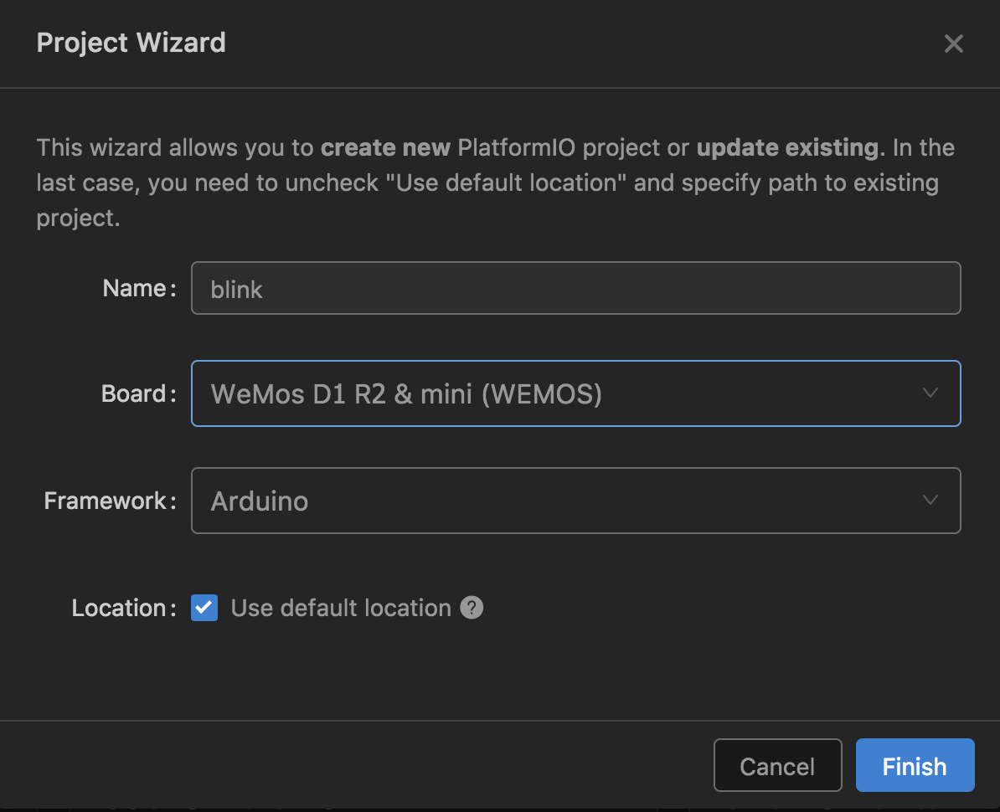
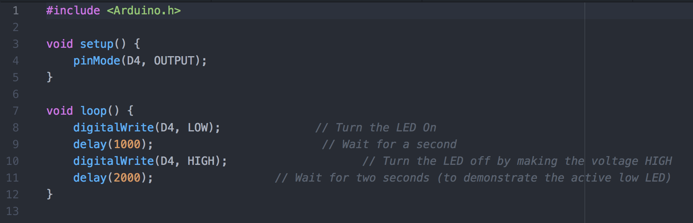
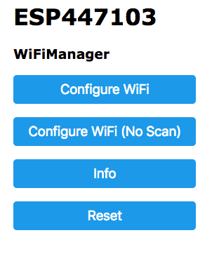
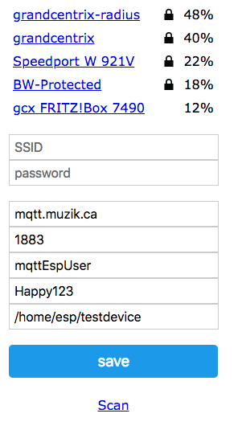

## ESP8266 Hacking Evening

A hacking evening hosted by Sean for learning about the ESP8266 and home automation. This is a basic introduction to the world of Arduino/ESP8266 for anyone who has no prior experience with electronics and microcontrollers. We'll be using basic code to get the $5 ESP8266 microcontroller up and running with a blink code (the hardware world's version of Hello World), then progress on to using some amazing libraries such as WifiManager and PubSubClient to control lights from Home Assistant.

Print off a copy of this image and keep it handy for reference: 


* D4 - LED | D3: GPIO0 (Bootmode) | D8 GPIO15 (Bootmode)

The above image shows how to name the pins in your code. You can use either the direct pin number (```2```) in your code, or the Wemos name (```D4```). Be careful using ```D3``` and ```D8``` as these are used during chip bootup. If these are hooked up incorrectly, your chip may not boot correctly so as a beginner I recommend not using these.


<table>
  <tr>
    <td>Date</td>
    <td>Version</td>
    <td>Description</td>
  </tr>
  <tr>
    <td>20180314</td>
    <td>0.1</td>
    <td>Base Version</td>
  </tr>
  <tr>
    <td>20180328</td>
    <td>0.2</td>
    <td>Updates</td>
  </tr>
</table>


# Setup & Basics

By the end of this section, you will be able to hook up and flash your ESP8266 chip with code via the USB Cable. This is the first step in getting familiar with microcontrollers, and is also the steps to be re-done should you "brick" your device.

## Download & Install Software

Most documentation is using the Arduino "IDE" -- Atom + Platformio is a much better combination. If you don't have atom, download/install from https://atom.io/. Within Atom, we will need to add the "platformio" addon which enables IoT programming for Arduino/ESP8266 and many other devices. Go to Atom -> Preferences -> Install, and search for platformio-ide:


Install all three of `platformio-ide`, `platformio-ide-terminal` and `platformio-ide-debugger`

Full installation instructions (including code completion) can be found at https://goo.gl/ABC1MV

When done, platformio will need to be restarted.

Windows + Mac Users will also need to install the CH340 Serial Driver [http://goo.gl/30vyKq](http://goo.gl/30vyKq)

## Your first sketch - Blink

The Wemos has an LED on it, which we can blink. This is the "Hello World" of the hardware world, and shows that we have working hardware, and a working path between your code and the flash storage of the microcontroller.

In Platformio, choose "New Project". Choose "WeMos D1 R2 & mini (WEMOS)" as these are the boards we have


In the project tree on the left, locate main.cpp:


Enter the following code:



Select Upload on the lefthand menu

You should now see the blue light blink continuously - on for 1s and off for 2s.

## Understanding the code


The blink sketch has two main parts, setup() and loop().

Setup runs once when the power is applied, and does any setup tasks such as defining a pin ("D4") and its direction (OUTPUT → We want to control something here, as opposed to INPUT where we want to read input from a motion sensor, keyboard, temperature sensor, etc).

Once setup completes, loop repeats forever (or until power loss). The LED is hooked to positive, and D4, so applying logic "High" to D4 means the light will turn off (counterintuitively).

# WifiManager + Base Code

WifiManager is a simple library which manges wifi (...what else did you expect?). The base code will perform the following functions:

1. During first start, become a Wifi Hotspot with the name ESP-ChipID (where the ChipID is the unique serial of the chip).

2. Ask for basic configuration settings: Which Wifi station to connect to, which MQTT Server to use, etc.

3. Enable Over the Air programming, so a USB connection is no longer required for Firmware Updates (NOTE:  Mistakes in your code may mean you need to revert to flashing via USB/Serial, since the OTA flasher is a part of your code.)

4. Configure a reset button to allow a factory reset (forget all wifi networks + saved settings)

Every ESP project will start with this base code, and add additional features on top of these.

## Get the sample code

Download all the code for tonight from the following URL:

[https://github.com/mitchese/esp8266-learnevening](https://github.com/mitchese/esp8266-learnevening)

Open the code found in the "Base" folder and upload this to your ESP8266 in the same way we flashed blink.

## Review the serial monitor

Connect to the serial monitor and observe what the ESP is doing.


## Configure in the captive portal

Connect (using your phone or laptop) to the Wifi Hotspot ESP-<**your**chipid>. **Ensure you are using yours, and not your neighbours!!**

On the main screen, choose "Configure WiFi":



Configure with the settings described on your cover sheet.


After saving, you should be presented with the following screen:


If the ESP8266 needed to change WiFi Channels to match our network, you will be kicked off. Re-connect to ESP8266-<yourchipID> and verify the ESP shows a successful connection.

Click Exit Portal to complete configuration.

You are done this exercise when you have exited the portal and your serial monitor shows that it's successfully connected to our test MQTT broker.


# MQTT + Light Control

MQTT is a protocol designed for small, lightweight communications over unreliable networks. Clients can publish or subscribe to messages. The broker is an always-on system that a client can sporadically connect to and send/receive updates from:


Topics are in the form of a path which can be user-defined, for example

**/home/kitchen/light**

to represent a light in the kitchen. Automation software such as HomeAssistant will subscribe to everything (also known as "#"), to be notified of any changes while small microcontrollers will subscribe or publish to a specific topic.

Subscriptions can happen to either a specific topic (if this is a heating sensor in the kitchen) "/home/kitchen/tempsensor" or + is a wildcard for every topic. For example, a display to show all temperatures in a home could subscribe to  “/home/+/tempsensor”.

In our next example, the ESP8266 will subscribe as a light. You will "subscribe" to the topic

/gcx/<yourname> (NOTE:  Actually, your ESP will subscribe to /gcx/<yourname>/set to receive commands, however the ‘set’ is included automatically in the code. My code accepts the base topic "/gcx/<yourname>" then applies different endings depending on the function required)

The Publisher will be HomeAssistant which will "publish" commands to control the light. HomeAssistant will publish a message at “/gcx/<yourname>/set” with a specific JSON text in the data. A sample of the JSON text is as follows: 


Because your ESP8266 is subscribed to this topic, it will receive the message and take appropriate action (turn the light on/off or set the colour). It will then confirm this action back to HomeAssistant, to notify that the action has been completed.

## Hookup the LED

We will be using a single RGB light in this example, however with an amplifier this can be extended to an entire room light. For an example of this, see the LED Strip which is running the exact same code.

You have a light with four wires coming out of the bottom. The longest wire is hooked to +, then each of the shorter wires are hooked to the R/G/B pins of the Wemos

Below is a diagram of the LED: 


Hooking the longest pin to 3V3 (3.3V, or +), and the right-most pin (as above) to GND (-), would make the light turn red.  Hooking up the longest pin to +, and the two outermost pins to - will turn on Red and Blue simultaneously, to give a purple colour.  We will therefore connect the Common Anode to +, and each of the B, G, R pins to D6,D1,D5 (GPIO 5/12/14) (NOTE:  Why not just use D1/D2/D3? You can! However, this matches the pins used in the MagicLight.) of the Wemos (NOTE:  The Wemos is very limited in the amount of current it can support. This simple example already overloads the wemos, so we must always use an amplifier.) - this way the Wemos can control which of the lights is currently on, as well as how bright each colour is. As in the Blink example, this control will be reversed; LOW means "on" and HIGH means “off”.

Hook up the LED according to the diagram below: 


## Get the Code

Find the code in the "rgbled" folder downloaded from Github. This extends the base code to include a subscription to the /gcx/yourname/set, and interprets JSON output and sets the pins accordingly.

## Upload via OTA Updates

In Platformio you can configure over the air updates according to the documentation here: http://docs.platformio.org/en/latest/platforms/espressif8266.html#over-the-air-ota-update
. To avoid accidentally programming someone else’s ESP, we’ll be doing this by hand since the platformio project is the same for everyone.

Choose the "build"  option in Platformio. This will compile and save the binary under "esp8266-learnevening/rgbled/.pioenvs/d1_mini/firmware.bin"

In your browser, go to http://esp8266-yourchipid/ and upload the bin file from above. Keep an eye on the serial monitor to ensure everything goes as expected. Any problems, upload via USB.

The OTA Upgrade is handy if the module is built into a hard to reach place, or does not have a built-in USB programmer (Sonoff, MagicLight, etc).

## Try it out

Connect to HomeAssistant at the URL described in the cover sheet. Find your name in the list of Lights, and turning your light on/off should turn your LED on/off. With the light on, clicking your name should bring up a colour picker popup, which should change your LED to the correct colour.

## Extra Credit

I have a few meters and rings of WS2812 LEDs. These are special because they are individually controllable, instead of the entire strip. Check out the FastLED Library for working with these strips  -- [https://goo.gl/cKtTPv](https://goo.gl/cKtTPv)

# Additional Code

The first example used the Wemos as an ouput from HomeAssistant, to control a light. I have a box of assorted input / output devices which you’re welcome to try out for the rest of the evening. You can sense motion, temperature, light, humidity and barometric pressure; You can control a servo, individual LEDs (WS2812 in bar or ring form), read/write from a MicroSD Card or do what you like.

Most arduino sensors will work out of the box. Note that the ESP8266 can only handle 3.3V on the input pins, and the ADC can tolerate a maximum of 1V.

For example, if you choose a DS1820 temperature sensor:

## Hookup


The DS1820 is a 1-Wire temperature Sensor. Data only needs to be hooked up to the Wemos on a single pin (DQ → D2). This allows the Wemos to read the temperature at the sensor and either take appropriate action itself, or simply report the value on the MQTT bus so other devices can take action.

Connect GND to (-), DQ to the Wemos pin D2 and Vdd to 3.3V as shown below


## Code

Search the Internet for appropriate code "Arduino DS1820" and adjust the code found into the “setup()” and “loop()” functions of the base code. Please avoid use of the ‘wait’ or ‘delay’ functions, as these may cause the watchdog timer to reboot your chip.

## Extra Credit

* Re-configure your code to use data.sparkfun.com or similar service to graph any input data

* Work with your neighbour (or implement by yourself) a sensor + an output (example might be a temperature controlled LED)

# Wrap-up & Further Documentation

I hope you had fun! Everything in this presentation, including the configuration of the Raspberry Pi (HomeAssistant and Mosquitto) are available on my Github. Note that this was primarily written for this demo and ease of use, so many security features are left off (HomeAssistant can accept passwords, but does not; MQTT Authentication is in plaintext, but two SSL Ciphers are supported by the ESP8266, etc). **Security is left up to you, so read the documentation!**

The demo from this presentation was setup as follows: 

* Alexa (Echo) can control Philips Hue lights

* HomeAssistant uses a software (fake) Hue Bridge, so anything attached to HomeAssistant is suddenly a Hue light, enabling Alexa control.

* Mosquitto, an open source MQTT Broker, is setup on the same system as HomeAssistant

* HomeAssistant is subscribed to any message on the broker, and will publish commands

* The Wemos devices publish / receive updates over MQTT

* Alexa → Hue → HomeAssistant → MQTT → Wemos → MQTT → HomeAssistant

For further information, please see the following resources: 

* ESP8266 Datasheet  [https://goo.gl/lKeUfF](https://goo.gl/lKeUfF) 

* /r/esp8266 on Reddit [https://goo.gl/apXQ37](https://goo.gl/apXQ37) 

* HomeAssistant [https://goo.gl/id0HO8](https://goo.gl/id0HO8) 

* Andreas Spiess [https://goo.gl/8WfBbY](https://goo.gl/8WfBbY) 

* BRUH Automation [https://goo.gl/aaNRsY](https://goo.gl/aaNRsY) 

* DS18S20 Datasheet: [https://goo.gl/tmbRJL](https://goo.gl/tmbRJL) 

* Programming without Arduino ("make" chain) [https://goo.gl/iBZmLR](https://goo.gl/iBZmLR)

* MicroPython on the ESP8266 [https://goo.gl/SPxOKl](https://goo.gl/SPxOKl) 

* Intereting Blog [https://goo.gl/2cFA6O](https://goo.gl/2cFA6O) 

* Blog about SSL + Encryption (German)[https://goo.gl/x8Qtk8](https://goo.gl/x8Qtk8) 

**Checklist for Presentation**

Below is my personal checklist before I do this presentation, to ensure I have all items prepared. If you want to do an evening, then I suggest you setup the following and have the following items ready to go: 

☐ MAC Addresses registered in DHCP Server

☐ HomeAssistant Configured: Participant lights, HueBridge, Temp Probes 
☐ Projector screen: MQTT Subscribe #

☐ Projector screen: homeassistant

☐ Mosquitto running; HomeAssistant running and available; Echo able to connect

**Pack list for each participant**

☐ Information package

☐ Wemos D1 Mini programmed with ChipID Code

☐ MicroUSB Cable

☐ 9x Dupont wires

☐ RGB LED

☐ Temperature Sensor

**Pack List for presentation**

☐ Raspberry Pi (HASS/Mosquitto)

☐ 1x WRT54GL (DHCP Adjusted + Client Bridge setup)

☐ Sonoff Switch device sample

☐ ESP Base Chip

☐ MagicLight Module

☐ MagicLight + 2M LED Strip + 12V Power Supply

☐ WS2812b strip + power supply

☐ Amazon Echo

☐ Oscilloscope?

Infrastructure

192.168.1.2: laptop with MQTT + HomeAssistant config 

