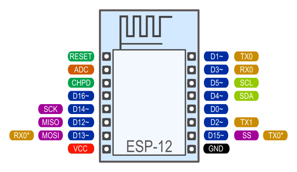
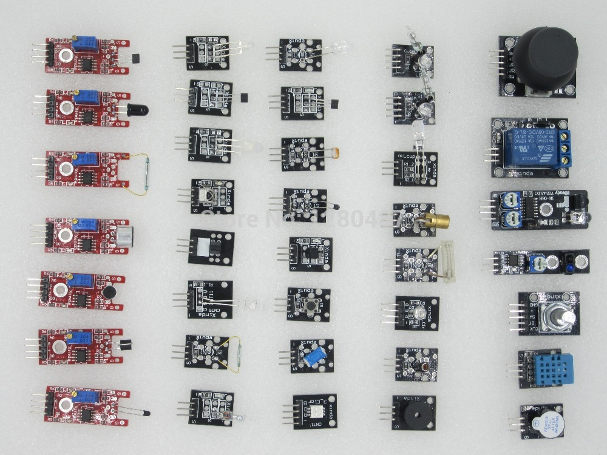
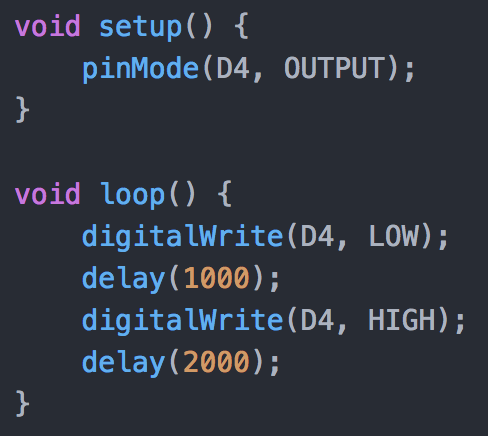
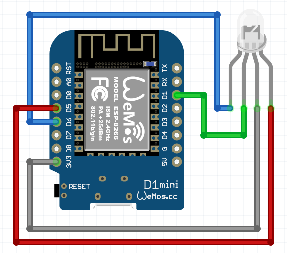

autoscale: true

# [fit] ESP8266
Sean Mitchell
April 11 2018
https://srm.im

---

# Agenda

* What is it
* Why ESP8266
* How can I use it
* Hello World
* WifiManager
* Distros

---

# WTF

What is it

* Fairly powerful microcontroller
* 3.3V with 5V capable inputs
* "An Arduino with WiFi"
* External flash storage ranging from 512K - 16MB (128Mb)
  * Depends on your module
* Full Datasheet: https://goo.gl/jckoSJ

---

# Why ESP8266

* Good, Cheap, Easy. Choose ~~2~~ 3
* Huge & Vibrant Community
* Many modules
  * Wemos, NodeMCU, bare module, among others
* Integrated in some finished products (Sonoff,etc)

---

# How to use

* Programmers vs built-in
* Arduino "IDE" or Atom.io
* Wiring Diagram

---

# Modules

* Inputs
  * PIR (Motion)
  * DHT11/22 (Temp/Humidity)
  * HC-SR04 (Distance)
  * AS3935 (Lightning)
* Outputs
  * Relays (220V)
  * LEDs
  * Text displays (LCDs)
  * Servos

---

---

# Getting our hands dirty

In your bag, you will find one Wemos D1 Mini. Plug it into your computer and let's make something work!

Follow the instructions for blink.

---

# Using WiFi

Follow the instructions for the Base code or skip to the rgb led code

This will work either on your Wemos D1 - or if you were to flash it to my MagicHome controller, it would work immediately

---

# Hooking to HomeAssistant

MQTT we can integrate our light into HomeAssistant

* Allow complex control and automation
* Act / React to all kinds of events
  * HomeAssistant connected to Kodi (XBMC); when TV on, then dim lights
  * Scrape times from Deutsche Bahn & show status of my next train
  * When doorbell rings, notify HomeAssistant; if I'm home, pause TV; otherwise push notification
  * Log temperature / humidity to Prometheus / Grafana

---

# HASS setup

HomeAssistant is running hass.io on the raspberry pi here; Connect your MQTT and we can play around with it

---

# [fit] ENDE

---
